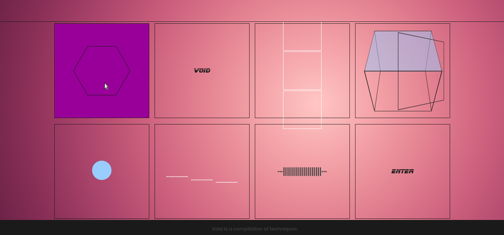

## [Void](https://adrisolid.github.io/Void-techniques/)

Void is a geometric compilation

:large_orange_diamond:
:large_orange_diamond:
:large_orange_diamond:
:large_orange_diamond:
:large_orange_diamond:
:large_orange_diamond:
:large_orange_diamond:
:large_orange_diamond:
:large_orange_diamond:
:large_orange_diamond:
:large_orange_diamond:
:large_orange_diamond:
:large_orange_diamond:
:large_orange_diamond:
:large_orange_diamond:
:large_orange_diamond:
:large_orange_diamond:
:large_orange_diamond:
:large_orange_diamond:



### To run

- You'll need to have [git](https://git-scm.com/) and [node](https://nodejs.org/en/) installed in your system.
- Fork and clone the project:

```
git clone ''
```

- Then install the dependencies:

```
npm install
```

- Start, check => localhost:8080

```
npm start
```
